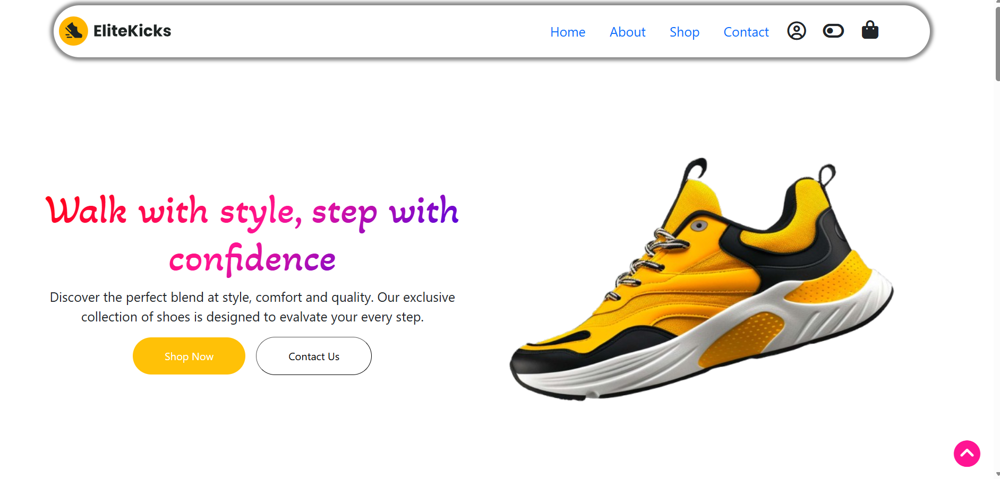
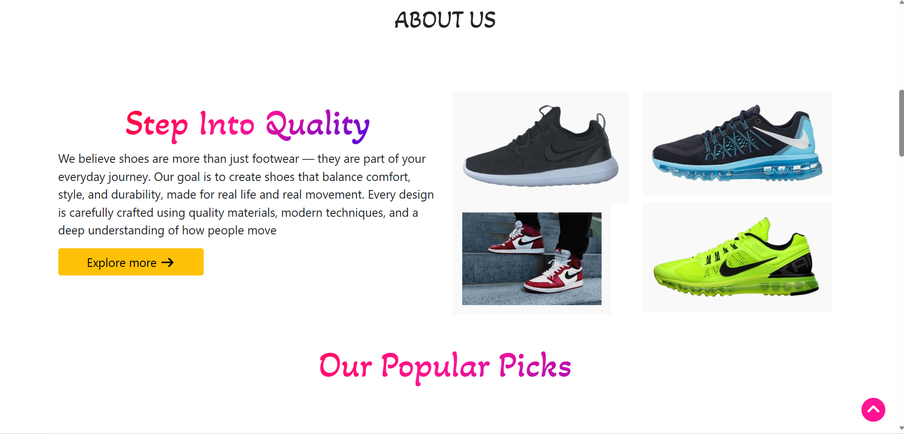
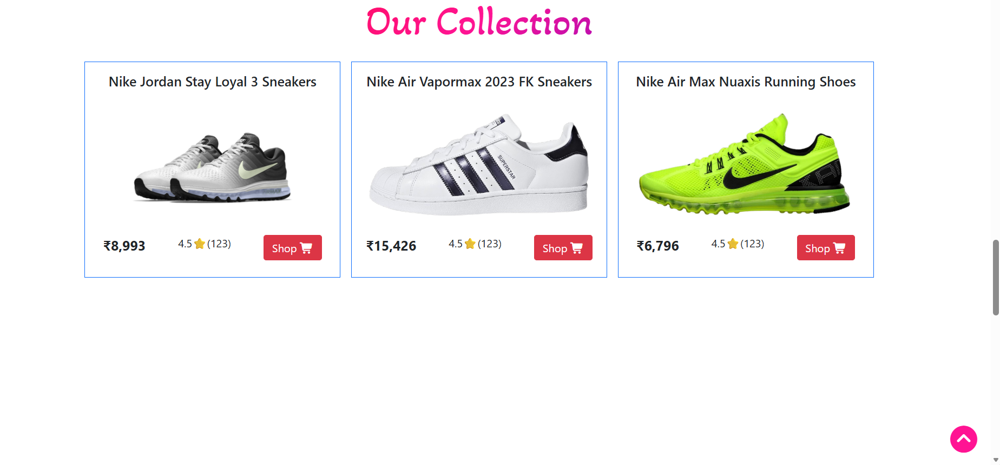
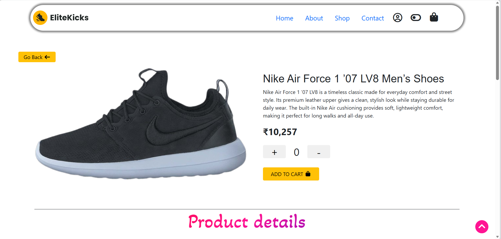
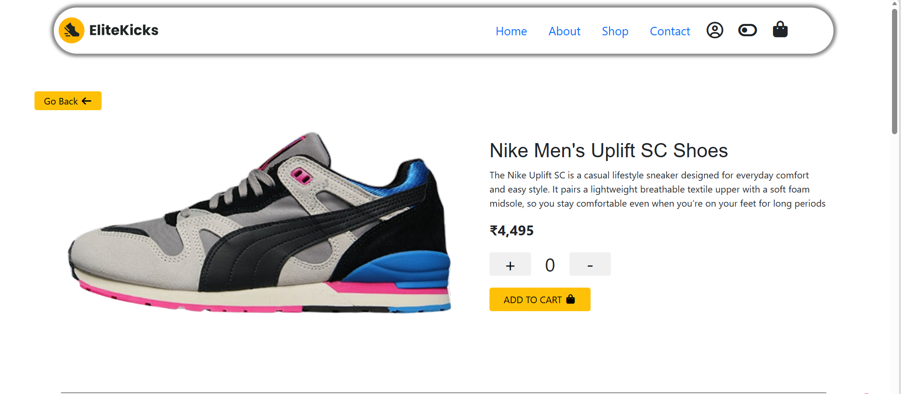
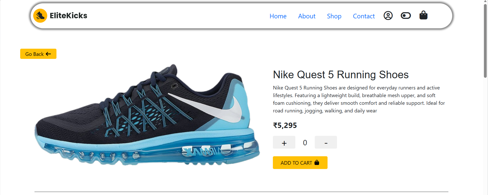
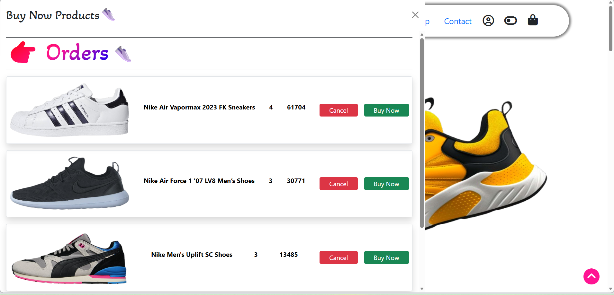

## 

<p align="center"> Modern shoe shopping website built with Bootstrap, smooth animations, and cart functionality. </p> <p align="center">

</p>

## **⭐ Project Preview / Live Demo**

You can view the live version of the project here.

**Github :** https://github.com/nikhilkale2/EliteKicks

**Deployment :**

## **🚀 Technologies Used**

HTML

CSS

Bootstrap

JavaScript

GSAP

Lenis

LocalStorage

## **✨ Features**

Add to Cart functionality

Buy Now option

Remove items from Cart

Theme changer (Dark / Light mode)

Cart data saved using LocalStorage

Smooth scrolling animations

##**📁 Project Structure**

```EliteKicks/
├── index.html
├── shoes1.html
├── shoes2.html
├── shoes3.html
├── shoes4.html
├── shoes5.html
├── shoes6.html
├── shoes7.html
├── shoes8.html
├── shoes9.html
├── css/
├── script.js
├── shoes.js
├── cart.js
├── index.js
├── images/
```

## **📸 Screenshots**

**Home Page**





**Shoes Product Page**





**Cart Page**



## **🔮 Future Improvements**

Payment gateway integration

Backend integration using Node.js and database

User authentication with database

Product search and filter functionality

## **👨‍💻 Author**

**Nikhil Sunil Kale**
